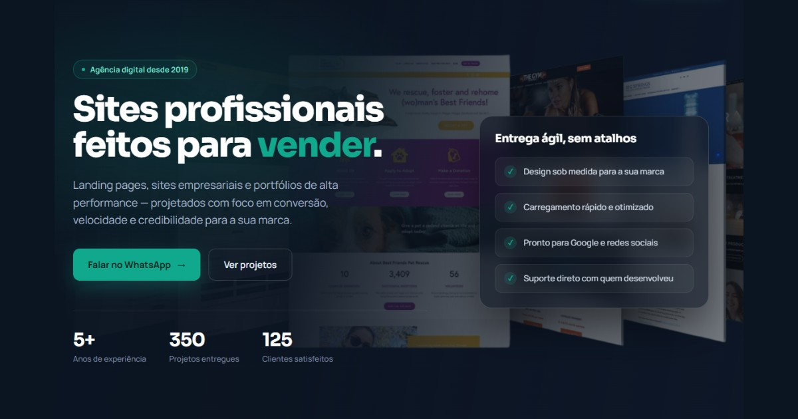

<p align="center">
  
</p>

<h1 align="center">SitesVeloz</h1>

<p align="center">
  Landing page institucional da SitesVeloz — agência digital especializada em sites profissionais,
  landing pages de alta conversão, portfólios e biosites.
</p>

<p align="center">
  <a href="https://sitesveloz.com.br/">🔗 sitesveloz.com.br</a>
</p>

<p align="center">
  
  
  
  
  
  
  
  
  
</p>

<p align="center">
  
</p>

## Sobre o projeto

Site institucional em página única (one-page) da SitesVeloz, construído com foco em **conversão**,
**velocidade de carregamento** e **SEO**. Apresenta os serviços da agência, portfólio de projetos
entregues, FAQ e um caminho direto para orçamento via WhatsApp.

## 🛠️ Tecnologias

| Tecnologia | Uso no projeto |
|---|---|
|  | Estrutura semântica da página (`index.html`) |
|  | Estilos inline + `@media` e `@keyframes` para responsividade e animações |
|  | Lógica dos componentes dinâmicos (serviços, projetos, stats) |
|  | Carregado via CDN (unpkg) para renderizar os componentes do template |
|  | Compila JSX/ES6+ diretamente no navegador, sem etapa de build |
|  | Tipografia (Sora e Manrope) |
|  | Botão flutuante e CTAs com deep link para orçamento |

O `support.js` é um runtime próprio (`dc-runtime`), gerado a partir de TypeScript, responsável por
interpretar o template declarativo do `index.html` (`<x-dc>`, `sc-for`, `sc-if`, `{{ }}`) e montá-lo
em tempo de execução — sem build step no servidor, tudo acontece no navegador do visitante.

## ✨ Funcionalidades

- 🎯 Hero com CTA direto para orçamento via WhatsApp
- 🧩 Seções de serviços e portfólio renderizadas dinamicamente a partir de listas de dados
- 🖼️ Cards de portfólio com preview em screenshot ou iframe ao vivo do projeto
- ❓ FAQ em acordeão, sincronizado com dados estruturados `FAQPage`
- 📈 SEO completo: meta tags, Open Graph, Twitter Cards e JSON-LD (`Organization`, `WebSite`, `FAQPage`)
- ⚡ Otimizações de performance: `preconnect`, `preload` de imagem crítica, `lazy loading` e imagens em WebP
- 📱 Layout responsivo (mobile, tablet e desktop)

## 📁 Estrutura do projeto

```
sitesveloz/
├── index.html      # Página única: markup, estilos e template dos componentes
├── support.js      # Runtime (dc-runtime) que interpreta e renderiza o template
├── robots.txt      # Diretivas para crawlers
├── sitemap.xml     # Mapa do site para indexação
├── assets/         # Logo, imagens do hero, portfólio e ícones
├── uploads/        # Mídias enviadas pelo editor visual
└── _backup/        # Versão anterior do site (HTML/CSS/JS tradicional), mantida como histórico
```

## 🚀 Como rodar localmente

Não há etapa de build — é um site estático. Basta servir a pasta raiz:

```bash
# usando o servidor embutido do Python
python -m http.server 8080

# ou com a extensão Live Server do VS Code
```

Depois acesse `http://localhost:8080`.

## 👤 Autor

Desenvolvido por [Eduardo Rojas](https://eduardorojas.com.br).
